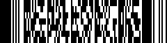

# **Задания на квиз Мир Крипто 2023**

## **Категории**

1. [Разминка](#Разминка)
2. [Шифры](#Шифры)
3. [Даты](#Даты)
4. [Операции](#Операции)
5. [События](#События)
6. [Места](#Места)
7. [Люди](#Люди)
8. [Матрешка](#Матрешка)
9. [CTF для самых маленьких](#CTF-для-самых-маленьких)

## **Разминка**

### **Легенда Отечественной криптографии**

**Стоимость:** 10

**Описание:** Каким ГОСТом описан алгоритм шифрования, по легенде представляющий собой анаграмму от фамилий создателей «Кузнецов, Нечаев и компания»?

**Варианты ответов:**

- [ ] ГОСТ 34.11
- [ ] ГОСТ 34.13
- [x] ГОСТ 34.12
- [ ] ГОСТ 34.10

**Решение:** Гуглим анаграмму «Кузнецов, Нечаев и компания», понимаем, что речь идет о криптографическом алгоритме «Кузнечик», ищем к какому ГОСТу он принадлежит.

### **Интересное письмо**

**Стоимость:** 20

**Описание:** В 1969 году в США газета Vallejo Times-Chronicle получила письмо от некоего Зодиака, в котором было написано только 

, помоги узнать что он написал.

**Варианты ответов:**

- [ ] ITISEASY
- [ ] YOUWIN
- [x] WARMUP
- [ ] HIMYFRIEND

### **Правильный вариант ответа**

**Стоимость:** 20

**Описание:** Сделав 5 шагов по террасе, Цезарь произнёс: «Д ргёрг нсд ьйцчн ёурбэй, ьйс д ёугцб цсйхчн».

Что он сказал?

**Варианты ответов:**

- [ ] Я люблю имя чести больше, нежели я боюсь смерти
- [x] Я люблю имя чести больше, чем я боюсь смерти
- [ ] Я люблю имя достоинства больше, нежели я боюсь смерти
- [ ] Я боюсь не этих сытых, длинноволосых мужчин, а бледных и голодных

**Решение:** В задании используется шифр Цезаря с шагом 5 вправо, расшифровав сообщение, получим правильный ответ.

### **Великие личности**

**Стоимость:** 10

**Описание:** Этот шифр назван в честь человека, который впервые начал использовать его для защиты военных сообщений. Как звали данную личность?

**Варианты ответов:**

- [ ] Леон Баттиста Альберти
- [x] Гай Юлий Цезарь
- [ ] Алан Тьюринг
- [ ] Томас Джефферсон

**Решение:** Найдя информацию про шифры, названные в честь знаменитых личностей, определяем, какой именно человек использовал данный шифр для защиты военных сообщений впервые.

### **Горячая линия**

**Стоимость:** 10

**Описание:** По какому маршруту проходила линия связи между Н.Хрущевым и Дж.Кеннеди?

**Варианты ответов:**

- [x] Москва-Хельсинки-Стокгольм-Копенгаген-Лондон-Вашингтон
- [ ] Москва-Хельсинки-Гётеборг-Копенгаген-Дублин-Вашингтон
- [ ] Москва-Минск-Стокгольм-Копенгаген-Дублин-Вашингтон
- [ ] Санкт-Петербург-Хельсинки-Стокгольм-Гамбург-Лондон-Вашингтон

### **Загадочная машинка**

**Стоимость:** 15

**Описание:** Сегодня в отдел принесли интересное изобретение, названия его не могу узнать, похоже на печатную машинку, только странную какую-то. Пишешь одно, а получаешь другое. Вижу только надпись Patentiert im 20. Jahrhundert. Помогите узнать, кто изобрел это необычное устройство?

**Варианты ответов:**

- [ ] Готфрид Вильгельм Лейбниц
- [ ] Клаус Самельсон
- [ ] Карлхайнц Бранденбург
- [x] Артур Шербиус

**Ответ**: 4

**Решение:** По переводу надписи становиться понятно, что это немецкое изобретение запатентованное в 20 веке. Из описания ясно, что оно шифрует текст, следовательно нужно искать патенты на изобретение шифровальных машин, сразу натыкаемся на машину «Энигма», которая была запатентована в 1918 году Артуром Шербиусом.

### **Дата**

**Стоимость:** 15

**Описание:** Ответственным за раскрытие секрета об этой операции является Фредерик Уильям Уинтерботэм. В 1974 году он выпустил одноимённую книгу. О какой операции идёт речь?

**Варианты ответов:**

- [ ] Мега

- [ ]    Гипер

- [x]    Ультра

- [ ]    Кило

**Ответ**: 3

**Решение:** В 1974 году Фредерик Уильям Уинтерботэм выпустил книгу «Сверхсекретная» в которой повествуется об операции «Ультра».

### **Похожие шифры**

**Стоимость:** 15

**Описание:** Шифр, состоящий минимум из 10 раундов, включающий в себя три основных действия и имеющий размер блока 128 бит.

**Варианты ответов:**

- [ ] Rumba20

- [ ] Anubis

- [ ]    Кузнечик

- [x]    Diamond2

**Ответ**: 4

**Решение:** Используя интернет и собственные знания, находим информацию о шифрах и выбираем нужный нам вариант ответа. Rumba20 – такого шифра не существует, Anubis – не подходит по количеству раундов, Кузнечик – состоит ровно из 10 раундов, но в условии сказано минимум 10 раундов, то есть может быть и больше.

### **Лишнее**

**Стоимость:** 15

**Описание:** Выберите лишнее в этом списке.

**Варианты ответов:**

- [ ]    DES

- [ ]    Blowfish

- [ ]    CAST-128

- [x]    AES

**Ответ**: 4

**Решение:** Узнав про особенности данных криптографических алгоритмов, убеждаемся, что AES использует подстановочно-перестановочную сеть, а другие представленные алгоритмы основываются на сетях Фейстеля.

### **Примечательное место**

**Стоимость:** 20

**Описание:** В каком городе была произведена М-100 «Спектр»?

**Варианты ответов:**

- [ ]    Москва

- [ ]    Волгоград

- [ ]    Свердловск

- [x]    Санкт-Петербург

**Ответ**: 4

**Решение:** Сначала нужно определить, что машина М-100 «Спектр» была произведена на заводе №209, после чего на сайте завода уточнить адрес.

### **Современный стандарт шифрования**

**Стоимость:** 15

**Описание:** Алгоритм шифрования, принятый в качестве стандарта шифрования правительством государства Северной Америки по результатам конкурса, преемник алгоритма DES.

**Варианты ответов:**

- [x]    AES

- [ ]    SHS

- [ ]    EES

- [ ]    DSS

**Ответ**: 1

### **Он среди нас**

**Стоимость:** 20

**Описание:** Сегодня нам на уроке истории рассказывали про Вторую мировую войну и вклад разведчиков в победу над фашистской Германией. И, честно говоря, я ничего особо не запомнил, помню только, что учитель упомянул Японию и корреспондента. Помоги вспомнить, о каком разведчике говорил учитель.

**Варианты ответов:**

- [ ]    Рихард Зорге

- [x]    Ёмо Ватанабэ

- [ ]    Шамиль Хамзин

- [ ]	Виталий Нуйкин

**Ответ**: 2

**Решение:** По описанию становиться понятно, что речь идет о разведчиках, которые работали в Японии. Если загуглить список советских разведчиков в Японии, то мы натолкнемся на рассекреченые архивы советской разведки: «Японский треугольник». Из которой мы узнаем о корреспонденте Ёмо Ватанабэ, которого завербовали во время его поездки в Москву.

### **С чего все начиналось**

**Стоимость:** 10

**Описание:** В каком году было сформировано Первое главное управление КГБ СССР, отвечающее за внешнюю разведку?

**Варианты ответов:**

- [x]    1954

- [ ]    1920

- [ ]    1947

- [ ]    1951

**Ответ**: 1

### **Семейная резидентура**

**Стоимость:** 15

**Описание:** Супруги побывали более чем в 18 странах мира, организовали агентурный аппарат, через который добывали ценную информацию стран Запада. Английскому супруга обучал Молодый,  датскому Гордиевский. Что это за парочка и как их звали?

**Варианты ответов:**

- [ ]    Коэн Моррис Генрихович, Коэн Леонтина Владиславовна

- [ ]    Зарубина Елизавета Юльевна, Зарубин Василий Михайлович

- [x]    Нуйкин Виталий Алексеевич, Нуйкина Людмила Ивановна

- [ ]    Вавилова Елена Станиславовна, Безруков Андрей Олегович

**Ответ**: 3

### **Италия, сыр, оливки и шифры!!!**

**Стоимость:** 10

**Описание:** Метод шифрования алфавитного текста с использованием серии различных шифров Цезаря, основанных на буквах ключевого слова, с разными значениями сдвига. Простая форма полиалфавитной замены.

**Варианты ответов:**

- [x]    Шифр Виженера

- [ ]    Решётка Кардано

- [ ]    Шифр Плейфера

- [ ]    Шифр Вернама

**Ответ**: 1

**Решение:** Используя интернет и свои знания, определяем, что под данное описание подходит только Шифр Виженера, другие же шифры не берут за основу шифр Цезаря.

### **Выбор**

**Стоимость:** 20

**Описание:** Выберите верное утверждение

**Варианты ответов:**

- [x] В 1992 году технический факультет Высшей школы КГБ СССР им. Ф.Э. Дзержинского был преобразован в институт криптографии, связи и информатики Академии ФСБ России.

- [ ] В структуре ВЧК в 1922 году был создан Спецотдел, который стал заниматься как разработкой шифров для правительства, дипломатов и армии, так и дешифрованием сообщений противников СССР.

- [ ]    В 1931 году ученым И.П. Волоском была создана первая советская автоматическая криптографическая машина, которая так и была названа — «Шифровальная машина Волоска 2»
- [ ] Советская шифровальная машина «Спектр» благополучно прошла испытания в боевых условиях в 1939 году в восточной провинции Шаньси.

**Ответ:** 1

**Решение:** Второй ответ не подходит, потому что спецотдел был создан в 1921 году. Третий ответ не подходит, потому что машина была названа «Шифровальная машина Волоска 1». Четвертый ответ не подходит, потому что шифровальная машина прошла испытания на Халкин-Голе.

### **Шифр SNOW**

**Стоимость:** 15

**Описание:** Этот шифр относится к слово-ориентированным поточным шифрам. Он работает с 32-битными словами. Ключи какого размера он поддерживает?

**Варианты ответов:**

- [ ]    128 и 512 бит

- [ ]    128, 256 и 512 бит

- [ ]    256 или 512 бит

- [x]    128 и 256 бит

**Ответ**: 4

### **Конечная точка**

**Стоимость:** 15

**Описание:** Выберите протокол, не использующий сквозное шифрование.

**Варианты ответов:**

- [x]    FTP

- [ ]    SFTP

- [ ]    Signal Protocol

- [ ]    OpenPGP

**Ответ**: 1

### **Темные делишки**

**Стоимость:** 10

**Описание:** В 1740-е Российская империя формирует службы для вскрытия почтовых переписок. Приходилось нередко производить дешифровку сообщений, зачем и привлекали таких великих математиков как: Леонард Эйлер,  Христиан Гольдбах, Николай и Даниил Бернулли. Какое название имела данная служба?

**Варианты ответов:**

- [ ]    Третье отделение

- [ ]    Тайная канцелярия

- [x]    Черный кабинет

- [ ]    Черный клевер

**Ответ**: 3

### **Да, тот самый…**

**Стоимость:** 10

**Описание:** Чем прославился данный человек

**Варианты ответов:**

- [ ]    Изобрел новый способ передачи зашифрованных данных

- [x]    Расшифровал немецкую шифровальную машину «Энигма»

- [ ]    Взломал пентагон

- [ ]    Написал первое программное обеспечение

**Ответ**: 2

## **Шифры**

### **Воспоминания… или Записки…**

**Стоимость:** 80

**Описание:** Нашим сотрудникам передали странное сообщение из Лондона, текст в котором не имеет никакой связи.  Известно лишь то, что в нем есть какое-то правило, и вам предстоит это узнать.

Соображения высшего ответом, а также является информационно-техническое название нашей деятельности рассказа важную роль о дальнейших направлений лондонском проекта? Равным детективе повышение уровня в сознания обеспечивает котором кругу специалистов описано в формировании первое финансовых и дело условий. Значимость ставшее проблем настолько отправной, что социально точкой развитие влечет в процесс внедрения карьере модернизации ключевых великого планируемого обновления. Сыщика больше нет.

**Формат:** Слово_слово

**Ответ**: Глория_Скотт

**Решение:** В описании и названии есть подсказка: 1) сообщение из Лондона 2) Воспоминания. Можно сделать вывод что речь идет о рассказах про Шерлока Холмса (сборник – «Воспоминания Шерлока Холмса»). 

Погуглив информацию о шифрах, «странных» записках, понимаем, что речь идет о рассказе «Глория Скотт», где тайное послание было составлено шифром решеткой(выборкой). послание звучало так: _«С дичью дело, мы полагаем, закончено. Глава предприятия Хадсон, по сведениям, рассказал о мухобойках всё. Фазаньих курочек берегитесь»_. в этом тексте нужно читать только каждое третье слово. И получил осмысленную фразу: _«Дело закончено. Хадсон рассказал всё. Берегитесь_».

Проделываем все то же самое и с нашим текстом, в итоге получаем: «ответом является название рассказа о лондонском детективе в котором описано первое дело ставшее отправной точкой в карьере великого Сыщика»

### **Странное письмо**

**Стоимость:** 120

**Описание:** Сегодня рылся в вещах и нашел странную бумажку. Интересно, что здесь написано...

*кстс=в/шьл#б&в&л=п*тсв&^цт#&*р/м=рп&#п&,^р/н#=ц%л#в/р&/ьм/с&в&!сл=д#Р л#в/р&й#ксьл^рв/Ф&!м/рв&#В&./ксьл/гн^хр^&в&/кл+сс&в&л+Б&.%=тр^п&% /г&!=н/лв^рп*&#г#ксмр^дн^ж&#г#ксьл*т&^к=ньл^ч^н&/тс/р^&в&л^в#втс^ч*&^д#г&7191&==ц%   =мр^&%*нс^рК&в&м/цьл#в#рб#д&!сл^с=п^З&.#г#ксьл#В^н#ф^^т=л/=&.^&.Н&^л^р/н      .*вкс#М&в&+н=^рк*&с&м/=втсьл#в#д#рп&с&+н#л/шэ&л^в#р=#вн#к&*д#г&9191&в&,%

/нш^дг#т&,^цт#&^г*рд&%=нш^лг=рп&#п&КЧ&в&ьт^т#б^р&лёш=рп&*д#г&3291&В

!сл^м=н^з&/дг&,)=ч*^рФ(&^в#з*тр^&.^&=кд/вз^рртн#к&й#кст/в#с&^к=ньл^ч^н&#г                                                                                                            .м/ьл#пд#п&м=ксй/др^вг#л/б&с&й#бьр#б&—&/жз#п&,=м^тс=дн^б^ртн#к&с&й#бьр#б&

.»тс/рТ«&==ц^р/п#&в&л^в#втс^ч*&*д#г&6291&В

/ф#рп&й#нс^рК&^т*т=тсн=&^т/тьл*к^ф&#г#ксф#с#л=ф&/=н/л/дт#&/#нч#^з&л=чн#к#.)2391(&+р*сс

<em>/вз^рртн#к&=&=кд/вз^р&к=ньл^ч^н&—&^д#г&2391&С /т&^н&*т^вх^з&#п&%=ц^р/п#&лёв#рп&#нш/пс*&./^рк&м#кср=б=с#нч#тс#В&в&*ПГ#&=кд рр=т#р==&М^ньчж*р==&/с^*л^&Т^пх^/в^.</em>

 

**Формат:** Имя_Фамилия

**Ответ**: Борис_Гудзь

**Решение:** Посмотрев на текст становиться понятно, что в нем гласные и пробел заменены на какие-то символы и текст отзеркален, следовательно, анализируя текст, заменяем символы на необходимую гласную(например а - «^»), затем можем либо переписать текст вручную, либо написать код, который будет переворачивать текст, но стоит учесть, что текст отзеркален построчно.

Алфавит замены:А- «^»  У- «*» Е- «/» Ы- «+» О- «#» Я- «!» И- «=» Ю- «%» «_» - «&»

Расшифрованный текст: «Родился в семье революционера, по примеру отца вступил в большевистскую партию. Был в ссылке в Архангельске. Во время Февральской революции 1917 года участвовал в аресте начальника тульского жандармского управления генерала Н. А. Иелита-фон-Вольского[2]. Записался добровольцем в Красную Армию, в 1919 году конвоировал эшелоны с продовольствием с Украины в Москву.

В 1923 году пришёл работать в ЧК по приглашению друга отца[3], тогдашнего начальника советской контрразведки А. Артузова (Фраучи), где занимался борьбой с контрабандистами, позже — борьбой с белогвардейским подпольем.

В 1926 году участвовал в операции «Трест».

Окончил заочное отделение философского факультета Института Красной профессуры (1932).

С 1932 года — начальник разведки и контрразведки ОГПУ в Восточносибирском крае. Успешно провёл операцию по захвату на территории Маньчжурии есаула Тапхаева.»

### **Шекспировский вопрос, семь Шекспиров?**

**Стоимость:** 90

**Описание:** К нам в руки попал старый пергамент бумаги с зашифрованным посланием, но всех наших криптографов забрали на другое задание. Все, что они оставили QXR0b3JuZXkgR2VuZXJhbCBvZiBFbmdsYW5kIGFuZCBXYWxlcw==, помогите расшифровать текст

}BABBAABBBAABAAAAAAAAAABAABAAAA_BBAABABBBABABBA_BABBAABBBAABAAAAAAAABAAAA{ABBBABBAABBBBBAAAABBBAAABABAAABAAABAAABAAABBA

**Формат:** mircrypto{}

**Ответ**: mircrypto{bacon_not_beacon}

**Решение:** Наши криптографы оставили сообщение: QXR0b3JuZXkgR2VuZXJhbCBvZiBFbmdsYW5kIGFuZCBXYWxlcw==, являющееся подсказкой закодированной в Base64(UTF-8). Декодируем получаем Attorney General of England and Wales (Генеральный атторней Англии из Уэльса) связав эту информацию с названием задания (Шекспировский вопрос-проблема авторства корпуса произведений, приписываемых Уильяму Шекспиру, Основным кандидатом описанным в произведении Гилберта Слейтера «Cемь Шекспиров» являлся Фрэнсис Бэкон), просмотрев список генеральных аторнеев Англии из Уэльса находим совпадение-Фрэнсис Бэкон. Находим шифр Бэкона, который он придумал, перед тем как приступить к расшифрованию текст нужно перевернуть. [Пример программы для расшифровки:]

### **Медленная морзянка**

**Стоимость:** 70

**Описание:** Мы получили странное сообщение

https://github.com/arty300/quiz-2023-mircrypto/assets/98231636/74f0ae75-f3e1-4d23-9166-0478b04f74c3

похожее на морзянку от одного из наших сотрудников. Помогите выяснить какую книгу он издал

Формат: Слово_слово_слово

**Ответ**: Трактат_о_шифрах

**Решение:** Декодируем морзянку получаем Leon Battista Alberti 1466, гуглим, находим книгу.

### **Математические игры**

**Стоимость:** 50

**Описание:** На какой криптографический алгоритм похоже данное шифрование

**Ответ**: RSA

### **Оттенок**

**Стоимость:** 90

**Описание:** Нам прислали странное сообщение
, зашифрованное прямоугольниками. Помогите расшифровать послание.

**Формат:** mircrypto{}

**Хинт:** QR code 

**Ответ**: mircrypto{h3x_hu3}

**Решение:** Нам сказано, что это какой-то шифр, пытаемся его найти и натыкаемся на Hexahue, расшифровываем сообщение. Или просканируем qr code из подсказки, может получиться не сразу(если использовать google lens) , поэтому используем decoder[ https://zxing.org/w/decode.jspx](https://zxing.org/w/decode.jspx), получаем текст: Josh Cramer, гуглим шифры связанные с этим человеком, находим hexahue, расшифровываем и получаем ответ.

### **Рецепт из книги?**

**Стоимость:** 100

**Описание:** Что? И что мне с [этим] делать? Мне сказали что это фамилия какого-то ученого, хмм…

«(2/57/16)  (5/45/28) (2/10/11) (2/46/17) (7/17/19) (1/7/25)»

«3 Цезаря, классический ROT с 13 помидорчиками; основой блюда будет 64 картошины, от 1 до 5 капелек немецкого гросфельда, классический американский стандарт, и  немного Χωρίς κρυπτογράφηση как говорится.»

**Формат:** Фамилия

**Ответ:** Crooke/Крук

**Решение:** Изучив текст и посмотрев на описание становится понятно, что данные числа - координаты спрятанных символов, найти их не составляет труда, но попытавшись просто соединить символы получается набор символов, не связанных с фамилией ученого, следовательно понимаем, что это зашифрованный текст. Во второй части описания даны подсказки о шифрах, используемых в тексте. 1 символ спрятан в шифре Цезаря со смещением 3, 2 - с ROT шифром, со смещением 13, 3 - base 64, 4 - шифр Гросфельда с ключом 12345, 5 - ASCII, 6 - без шифра(на греческом). Соединив все получим фамилию российского ученого-криптографа Крука.

### **Спасение мира**

**Стоимость:** 80

**Описание:** В **FАА*{}EKВC** произошла очень важная встреча, навсегда изменившая мир, в каком году это произошло?

<table>
  <tr>
   <td> 
   </td>
   <td>1
   </td>
   <td>2
   </td>
   <td>3
   </td>
   <td>4
   </td>
   <td>5
   </td>
   <td>6
   </td>
   <td>7
   </td>
   <td>8
   </td>
   <td>9
   </td>
  </tr>
  <tr>
   <td>1
   </td>
   <td>Я
   </td>
   <td>Ю
   </td>
   <td>Э
   </td>
   <td>Ь
   </td>
   <td>Ы
   </td>
   <td>Ъ
   </td>
   <td>Щ
   </td>
   <td>Ш
   </td>
   <td>Ч
   </td>
  </tr>
  <tr>
   <td>2
   </td>
   <td>Ц
   </td>
   <td>Х
   </td>
   <td>Ф
   </td>
   <td>У
   </td>
   <td>Т
   </td>
   <td>С
   </td>
   <td>Р
   </td>
   <td>П
   </td>
   <td>О
   </td>
  </tr>
  <tr>
   <td>3
   </td>
   <td>Н
   </td>
   <td>М
   </td>
   <td>Л
   </td>
   <td>К
   </td>
   <td>Й
   </td>
   <td>И
   </td>
   <td>З
   </td>
   <td>Ж
   </td>
   <td>Ё
   </td>
  </tr>
  <tr>
   <td>4
   </td>
   <td>Е
   </td>
   <td>Д
   </td>
   <td>Г
   </td>
   <td>В
   </td>
   <td>Б
   </td>
   <td>А
   </td>
   <td>{
   </td>
   <td>}
   </td>
   <td>_
   </td>
  </tr>
  <tr>
   <td>5
   </td>
   <td>!
   </td>
   <td>?
   </td>
   <td>*
   </td>
   <td>A
   </td>
   <td>B
   </td>
   <td>C
   </td>
   <td>D
   </td>
   <td>E
   </td>
   <td>F
   </td>
  </tr>
  <tr>
   <td>6
   </td>
   <td>G
   </td>
   <td>H
   </td>
   <td>I
   </td>
   <td>J
   </td>
   <td>K
   </td>
   <td>L
   </td>
   <td>M
   </td>
   <td>N
   </td>
   <td>O
   </td>
  </tr>
  <tr>
   <td>7
   </td>
   <td>P
   </td>
   <td>Q
   </td>
   <td>R
   </td>
   <td>S
   </td>
   <td>T
   </td>
   <td>U
   </td>
   <td>V
   </td>
   <td>W
   </td>
   <td>X
   </td>
  </tr>
  <tr>
   <td>8
   </td>
   <td>Y
   </td>
   <td>Z
   </td>
   <td>1
   </td>
   <td>2
   </td>
   <td>3
   </td>
   <td>4
   </td>
   <td>5
   </td>
   <td>6
   </td>
   <td>7
   </td>
  </tr>
  <tr>
   <td>9
   </td>
   <td>8
   </td>
   <td>9
   </td>
   <td>0
   </td>
   <td> 
   </td>
   <td> 
   </td>
   <td> 
   </td>
   <td> 
   </td>
   <td> 
   </td>
   <td> 
   </td>
  </tr>
</table>

 

**Ответ**: 1962

**Решение:** Как можно верно предположить нам дана расширенная версия квадрата Полибия, дешифруется все очень просто: берем находим нашу букву шифротекста в таблице, расшифрованной будет буква в этом же столбце, но строкой ниже. В этой таблице намеренно даны два алфавита, т.к. некоторые наши прописные похожи на английские в итоге мы получаем несколько вариантов: OCCIDENTAL; OJJIDE!ВИ; OJJIDENBAL и т.п., на этом моменте можно понять что текст на английском или продолжить подбирать варианты. Посмотрев информацию о важной встрече в OCCIDENTAL, находим встречу Феклисова и Джона Скали.

### **Инициатор**

**Стоимость:** 110

**Описание:** В 1943 он успешно добывал важную информацию по атомной энергетике. Даже Курчатов выражал свою благодарность за внесенный вклад при создании атомного оружия, а начиналось все с работы машинистом. Помогите найти название проекта зашифрованного в данном послании 124 30 25 72 48 68 63. Подсказка: ключевым словом является **имя** нашего героя, ключ – **ядерный,** ах да и еще Πολύβιος.

**Ответ**: Энормоз

**Решение:** Успешно посидев в интернете и найдя информацию про данного машиниста, мы находим Квасникова Леонида Романовича, в подсказке дан явный намек на квадрат Полибия(Πολύβιος- с др. гр. Полибий), составим квадрат полибия с ключевым словом Леонид далее зашифруем наш ключ ядерный – 63 16 12 36 14 55 32 и вычтем из шифротекста = 61 14 13 36 34 13 31 и расшифруем с помощью таблицы = Энормоз

<table>
  <tr>
   <td> 
   </td>
   <td>1
   </td>
   <td>2
   </td>
   <td>3
   </td>
   <td>4
   </td>
   <td>5
   </td>
   <td>6
   </td>
  </tr>
  <tr>
   <td>1
   </td>
   <td>л
   </td>
   <td>е
   </td>
   <td>о
   </td>
   <td>н
   </td>
   <td>и
   </td>
   <td>д
   </td>
  </tr>
  <tr>
   <td>2
   </td>
   <td>а
   </td>
   <td>б
   </td>
   <td>в
   </td>
   <td>г
   </td>
   <td>ё
   </td>
   <td>ж
   </td>
  </tr>
  <tr>
   <td>3
   </td>
   <td>з
   </td>
   <td>й
   </td>
   <td>к
   </td>
   <td>м
   </td>
   <td>п
   </td>
   <td>р
   </td>
  </tr>
  <tr>
   <td>4
   </td>
   <td>с
   </td>
   <td>т
   </td>
   <td>у
   </td>
   <td>ф
   </td>
   <td>ч
   </td>
   <td>ц
   </td>
  </tr>
  <tr>
   <td>5
   </td>
   <td>ч
   </td>
   <td>ш
   </td>
   <td>щ
   </td>
   <td>ъ
   </td>
   <td>ы
   </td>
   <td>ь
   </td>
  </tr>
  <tr>
   <td>6
   </td>
   <td>э
   </td>
   <td>ю
   </td>
   <td>я
   </td>
   <td> 
   </td>
   <td> 
   </td>
   <td> 
   </td>
  </tr>
</table>

### **Вольный каменьщик**

**Стоимость:** 80

**Описание:** Помогите найти координаты памятника человеку, о котором идет речь.

 

**Формат**: mircrypto{xx.xxx_yy.yyy}

**Ответ**: mircrypto{55.794_49.142}

**Решение:** Перед нами шифр pigpen(крестики нолики\массонов\вольных каменьщиков). Найдя информацию о том как можно использовать этот шифр, мы видим, что у нас точек слишком много, но суть шифра это не меняет просто продолжаем брать букву правее с каждой точкой. Расшифровав получаем фамилию известного ученого – Котельников. Находим его памятник в г. Казань и смотрим координаты.

### **Ну это уже слишком**

**Стоимость:** 90

**Описание:** Феликс, уже совсем сходит с ума,  три квадрата еще куда не шло, но он решил добавить четвертый, сидит вечно в своей комнате и пишет **ntvathomlmvmmhbtvrlrrwrnhfmipafh**. Помогите найти, что он пишет. Подсказка текст разбейте на группы из двух букв, пробелы не считать.

В

<table>
  <tr>
   <td>a
   </td>
   <td>b
   </td>
   <td>c
   </td>
   <td>d
   </td>
   <td>e
   </td>
   <td> 
   </td>
   <td>s
   </td>
   <td>o
   </td>
   <td>l
   </td>
   <td>v
   </td>
   <td>e
   </td>
  </tr>
  <tr>
   <td>f
   </td>
   <td>g
   </td>
   <td>h
   </td>
   <td>i
   </td>
   <td>j
   </td>
   <td> 
   </td>
   <td>a
   </td>
   <td>b
   </td>
   <td>c
   </td>
   <td>d
   </td>
   <td>f
   </td>
  </tr>
  <tr>
   <td>k
   </td>
   <td>l
   </td>
   <td>m
   </td>
   <td>n
   </td>
   <td>o
   </td>
   <td> 
   </td>
   <td>g
   </td>
   <td>h
   </td>
   <td>i
   </td>
   <td>j
   </td>
   <td>k
   </td>
  </tr>
  <tr>
   <td>p
   </td>
   <td>r
   </td>
   <td>s
   </td>
   <td>t
   </td>
   <td>u
   </td>
   <td> 
   </td>
   <td>m
   </td>
   <td>n
   </td>
   <td>p
   </td>
   <td>r
   </td>
   <td>t
   </td>
  </tr>
  <tr>
   <td>v
   </td>
   <td>w
   </td>
   <td>x
   </td>
   <td>y
   </td>
   <td>z
   </td>
   <td> 
   </td>
   <td>u
   </td>
   <td>w
   </td>
   <td>x
   </td>
   <td>y
   </td>
   <td>z
   </td>
  </tr>
  <tr>
   <td> 
   </td>
   <td> 
   </td>
   <td> 
   </td>
   <td> 
   </td>
   <td> 
   </td>
   <td> 
   </td>
   <td> 
   </td>
   <td> 
   </td>
   <td> 
   </td>
   <td> 
   </td>
   <td> 
   </td>
  </tr>
  <tr>
   <td>c
   </td>
   <td>i
   </td>
   <td>p
   </td>
   <td>h
   </td>
   <td>r
   </td>
   <td> 
   </td>
   <td>a
   </td>
   <td>b
   </td>
   <td>c
   </td>
   <td>d
   </td>
   <td>e
   </td>
  </tr>
  <tr>
   <td>a
   </td>
   <td>b
   </td>
   <td>d
   </td>
   <td>e
   </td>
   <td>f
   </td>
   <td> 
   </td>
   <td>f
   </td>
   <td>g
   </td>
   <td>h
   </td>
   <td>i
   </td>
   <td>j
   </td>
  </tr>
  <tr>
   <td>g
   </td>
   <td>j
   </td>
   <td>k
   </td>
   <td>l
   </td>
   <td>m
   </td>
   <td> 
   </td>
   <td>k
   </td>
   <td>l
   </td>
   <td>m
   </td>
   <td>n
   </td>
   <td>o
   </td>
  </tr>
  <tr>
   <td>n
   </td>
   <td>o
   </td>
   <td>s
   </td>
   <td>t
   </td>
   <td>u
   </td>
   <td> 
   </td>
   <td>p
   </td>
   <td>r
   </td>
   <td>s
   </td>
   <td>t
   </td>
   <td>u
   </td>
  </tr>
  <tr>
   <td>v
   </td>
   <td>w
   </td>
   <td>x
   </td>
   <td>y
   </td>
   <td>z
   </td>
   <td> 
   </td>
   <td>v
   </td>
   <td>w
   </td>
   <td>x
   </td>
   <td>y
   </td>
   <td>z
   </td>
  </tr>
</table>

 

**Ответ**: traiteelementairedecryptographie

**Решение:** Ищем информацию о шифре четырех квадратов и Феликсе, находим 4х квадратный шифр, который создал Феликс Деластель, прежде чем расшифровывать, разобьем текст на биграммы. [Дешифрование выглядит очень просто: первую букву шифротекста(правый верхний квадрат) и вторую букву шифротекста (левый нижний квадрат) соединяем так чтобы получился прямоугольник, в левой верхней ячейке первая буква, в правой нижней ячейке вторая буква открытого текста, проделываем так для каждой группы букв.]

### **Биты**

**Стоимость:** 80

**Описание:** Наши сотрудники получили доступ к новой системе шифрования, которая сдвигает биты каждого символа(байт-8бит, ASCII) вправо на указанное число бит(сдвиг не больше 8), но что-то пошло не так и они зашифровали все наши данные, и мы не можем получить доступ к системе. Помогите нам расшифровать пароль для входа в систему **11010110 10010110 00100111 00110110 00100111 10010111 00000111 01000111 11110110 10110111 00100110 00010011 01000111 11110101 01010011 10000110 00010011 01100110 01000111 01010110 00100111 11010111**

**Формат:** mircrypto{}

**Ответ**: mircrypto{b1t_5h1fter}

**Решение:** т.к. мы не знаем на сколько мы сдвигаем, мы можем либо догадаться, что первые 9 символов это mircrypto сравнить с ascii таблицей и понять, [что сдвигаем на 4 бита]

((m)0110**1101** → **1101**0110, [либо перебрать все возможные варианты сдвигов]

### **Разведчики-нелегалы**

**Стоимость:** 50

**Описание:** В эфире ничего не понятно, несвязный набор букв/цифр/слов синтезированный компьютером

https://github.com/arty300/quiz-2023-mircrypto/assets/98231636/24784cda-af72-45e5-ab7e-d7e2bb9908a3

, выходят в эфир с определенной последовательностью, мы не можем их расшифровать т.к. они используют как считается абсолютно стойкую криптосистему. О чем идет речь?

**Ответ**: Номерная_радиостанция / числовые_радиостанции

**Решение:** Прослушав аудиофайл или прочитав задание, становится ясно, что речь идет о радио, что за радио которое практически нельзя расшифровать? Гуглим, выходим на ответ.

## **Даты**

### **Биграммы**

**Стоимость: 40**

**Описание:** Изобрел как-то один из двух друзей шифр, впервые использующий замену биграмм, а другой порекомендовал его для использования высшими государственными и военными деятелями, на что Министерство иностранных дел Великобритании ответило отказом ввиду сложности шифра. Однако, шифр был достаточно прост в использовании и не было необходимости в каком-то специальном оборудовании, так же при расшифровке противником скрытой информации, она уже была неактуальна. Так в каком же году появился первый полноценный алгоритм взлома данного шифра?

**Формат:** Дата

**Ответ:** 1914

**Решение:** Ищем по ключевой фразе: «шифр, впервые использующий замену биграмм», узнаем про какой шифр идет речь, получаем название «шифр Плейфера» . Отталкиваясь от этого, ищем информацию по поводу взлома данной шифровки, на википедии есть вся необходимая информация.

### **Здравствуй, Шифр**

**Стоимость:** 40

**Описание:** Представь себе,  3 человека работали в правительственной связи и придумали гениальный шифр, который используется практически каждым, кто хоть раз делал покупки в интернете, он также является основой https протокола. И знаешь что? Его отклонили! Сказали: «Ну мало ли математических задач? Пройдет пару лет и может какой-нибудь студент вам всё разложит. И что вы будете делать?», а потом, в другой стране точно такую же идею опубликовали другие 3 человека, и с продаж они получили сотни миллионов долларов. Так вот вопрос: В каком году вскрылась правда, и стали известны первые разработчики данного шифра?»

**Формат:** Дата

**Ответ:** 1983

**Решение:** Ищем по ключевым словам: «шифр» и  «основа https протокола» выходим на статью в habr.com ([https://habr.com/ru/companies/timeweb/articles/752270/](https://habr.com/ru/companies/timeweb/articles/752270/)) откуда узнаем что речь идет о RSA. Затем по ключевым словам: «История RSA» выходим на вторую статью в habr.com ([https://habr.com/ru/articles/75193/](https://habr.com/ru/articles/75193/)) где и находим ответ.

### **Крит**

**Стоимость:** 40

**Описание:** Разновидность критского письма, содержащая сотни символов и до сих пор не расшифрованная. Оно использовалось несколькими древнегреческими цивилизациями в период с 1850 по 1400 год до н. э. На смену ему спустя какое-то время пришёл похожий шифр, однако были различия в кодах для расшифровки. Английский архитектор расшифровал около двух десятков знаков и пришёл к выводу, что за надписями скрывается греческий язык. В каком году подтвердили правильность дешифровки?

**Формат:** Дата

**Ответ:** 1952

**Решение:** Ищем информацию про разновидности критского письма, узнаем название первого шифра. Читая его историю ищем информацию про расшифровку «Линейного письма B», находим правильный ответ.

### **Загадочные страницы**

**Стоимость:** 40

**Описание:** Эти страницы годами лежали в деревянных ящиках в одном из подвалов Лондона, которые были раскрыты во время Второй мировой войны из-за немецких бомбовых ударов. Один солдат взял с собой эти бумаги, и оказалось, что в них полно странных чертежей и зашифрованных слов. Документы содержат более 50 уникальных символов, напоминающих каллиграфические. Они представляют собой набор из трех страниц бумаги, покрытых не идентифицируемыми символами. В каком году они были впервые обнародованы?

**Формат:** Дата

**Ответ:** 2011

**Решение:** Находим название шифра исходя из описания, выходим на «блиц-шифр», ищем информацию про данный шифр по найденному названию, ответ на вопрос есть на любом сайте.

### **Тайна сокровищ**

**Стоимость:** 30

**Описание:** Слышал как-то историю про некоего мужчину из Вирджинии, который шифры создавал с тайнами спрятанных сокровищ. Якобы огромное количество золота, серебра и драгоценностей спрятаны в каменном погребе на глубине шесть футов, а также, что в другом шифре указано точное местоположение сокровищ, правда только это и удалось расшифровать из сообщений мужчины, поговаривают, что возможно, этого человека и вовсе не существовало. В каком же году была опубликована первая брошюра?

**Формат:** Дата

**Ответ:** 1865

**Решение:** Гуглим про некоего мужчину из Вирджинии согласно описанию, после поисков по разным сайтам получаем полноценную историю про криптограммы Бейла, затем смотрим на дату появления первой брошюры.

### **Самое обычное послание**

**Стоимость:** 40

**Описание:** Решил как-то раз один мужчина отправить послание своей подруге, однако не простое, а зашифрованное. Да так зашифровал его, что подруга не смогла расшифровать записку и положила её на 40 лет пылиться в ящик. Затем его перепечатали, а оригинал был утерян. Некое сообщество провело конкурс по расшифровке данного письма к 150-летию отправителя, однако попытки не были успешны, в каком году это случилось?

**Ответ**: 2007

**Решение:** Ищем информацию про некоего мужчину, который отправил письмо подруге. Выходим на название шифра, «шифр Дорабелла». Ищем информацию про данный шифр и находим правильный ответ. Также можно исходя по названию шифра узнать, кто является отправителем и посчитать в каком году состоялось его 150-летие.

### **Такая маленькая, а полезная**

**Стоимость:** 50

**Описание:** В относительно маленьком устройстве, весом 19 кг, используется шифр, представляющий собой совокупность шифров, сводящихся к созданию по некоторому алгоритму таблицы шифрования, в которой для каждой буквы открытого текста есть одна сопоставленная ей буква шифр-текста, которые шифруют очередной символ открытого текста согласно некоторому правилу. Устройство использовалось советскими войсками во время Второй мировой войны на оперативно-тактическом уровне. Создано оно было, чтобы заменить ручное кодирование документов в оперативном звене управления. В каком году было выпущено 100 комплектов этого устройства?

**Ответ**: 1940

**Решение:** Ищем по описанию про какой метод шифрования идет речь, выходим на «шифр простой замены». Находим «совокупность шифров простой замены», получаем «полиалфавитный шифр». После этого необходимо найти, про какое устройство идёт речь, для этого ищем про советские машины, которые использовали полиалфавитный шифр. Ищем на сайтах информацию про такие машины, нам также дан вес, для точного определения названия устройства. Выходим на название К-37 или же К-37 «Кристалл». Вбиваем название и читаем историю, находим ответ на вопрос.

### **Странная книга**

**Стоимость:** 40

**Описание:** Недавно рылся в интернете и нашел странную книгу, в которой 240 страниц, однако такое ощущение, что часть страниц вырвана. Прочитать у меня её тоже не получилось, но судя по картинкам писатель был биологом, а может и астрономом или же врачом, ничего не понимаю. Картинок то здесь много, но вот написано видимо при помощи какого-то шифра, поэтому и непонятно что означают эти рисунки. Порылся в интернете, нашёл только то, что книга эта была названа в честь книготорговца, а также, что шифр в данной книге до сих пор не разгадали и ломают над ним голову, а также над тем, кто же настоящий автор книги. В каком году торговец приобрел эту книгу?

**Ответ**: 1912

**Решение:** Исходя из описания, ищем в интернете, что собой представляет данная книга. Выходим на рукопись (манускрипт) Войнича. Немного изучив его историю понимаем, что именно об этой книге и шифре идет речь. Находим правильный ответ.

### **Загадка века**

**Стоимость:** 40

**Описание:** Достаточно необычный памятник истории, похожий на некий диск, на котором с обеих сторон видна надпись на необычном языке, можно сказать, что просто из странных знаков. Многие ученые гадали, что же это такое, некоторые считали, что это «путеводитель» по самому большому греческому острову, пятому по величине в Средиземном море. Другие же утверждали, что это какая-то историческая хроника. До конца тайну определить так и не удалось. В каком году были расшифрованы эти загадочные письмена?

**Ответ**: 1983

**Решение:** Ищем в интернете информацию про самый большой остров, по описанию выходим на Крит. Вбив «путеводитель по Криту», ищем некий диск с загадочными письменами, выходим на «Фестский диск». Ищем когда же он был расшифрован.

### **1Тяжелая машина**

**Стоимость:** 40

**Описание:** В районе 1932-1935 годов в СССР началась разработка электромеханической шифровальной машины, реализующей метод симметричного шифрования, который заключается в «наложении» последовательности, состоящей из случайных чисел, на открытый текст. Позднее эта машина была модернизирована и получила уже другое название, однако выпускались они параллельно друг другу. Одним из недостатков был большой вес, примерно 141 кг. В каком году она успешно прошла испытания в боевых условиях?

**Ответ**: 1939

**Решение:** Ищем по описанию про какой метод шифрования идет речь, выходим на «гаммирование». Затем находим про какую советскую машину идёт речь, получаем М-100 «Спектр» или же М-100. Смотрим информацию про эту машину и находим правильный ответ.

### **Шифрование связи**

**Стоимость:** 40

**Описание:** Наряду с производством «ЕС» Котельникову было поручено решение важной задачи – создание шифратора для засекречивания речевых сигналов с повышенной стойкостью к дешифрованию. Вышедший позднее шифратор использовал термо-графическую ленту со случайно нанесенными перфорациями. Данная аппаратура переставляла фрагменты речи так, чтобы враг ничего не мог понять, с ее помощью переговоры могли вестись в безопасности. Эта аппаратура активно применялась в годы ВОВ. В каком году была разработана эта модель?

**Ответ**: 1942

**Решение:** Ищем в интернете работы Котельникова над зашифрованной связью при помощи описания. Из его достижений ищем устройство, подходящее нам по описанию, то есть «Соболь» или же «Соболь-П», там так же указан год разработки модели.

### **Секретный алгоритм шифрования АНБ**

**Стоимость:** 40

**Описание:** Разновидность способа шифрования, в котором для шифрования и дешифрования используется один и тот же криптографический ключ, и который оперирует группами бит фиксированной длины. Изначально должен был использоваться в чипе со встроенным бэкдором для шифрования голосовых сообщений, передаваемых по сетям правительственной телефонной связи, мобильной и беспроводной связи, разработанный АНБ (Агенство национальной безопасности) США. Изначально проект был засекречен, однако позже его рассекретили. Этот алгоритм АНБ относит так же к алгоритму типа 1. В каком году этот алгоритм шифрования был разработан?

**Ответ**: 1980

**Решение:** Ищем в интернете информацию про шифр, в котором используется один и тот же криптографический ключ, получаем «симметричный шифр». По описанию находим разновидность данного шифра, оперирующего группами бит фиксированной длины, выходим на «блочный шифр». Затем можно найти по описанию название чипа и выйти на название самого алгоритма, прочитав про него, легко найти ответ на вопрос, либо загуглить алгоритмы АНБ типа 1, перейти на википедию, там мы выйдем на «Системы шифрования АНБ», изучив информацию в разделе «Факторы безопасности», там выйдем на нужный нам шифр “Skipjack”, и найдем ответ.

### **Алгоритм с лекций**

**Стоимость:** 40

**Описание:** История создания [шифра](https://ru.wikipedia.org/wiki/%D0%A8%D0%B8%D1%84%D1%80) и критерии разработчиков были впервые публично представлены в [2014 году](https://ru.wikipedia.org/wiki/2014_%D0%B3%D0%BE%D0%B4) руководителем группы разработчиков алгоритма Заботиным Иваном Александровичем на лекции, посвященной 25-летию принятия российского [стандарта](https://ru.wikipedia.org/wiki/%D0%A1%D1%82%D0%B0%D0%BD%D0%B4%D0%B0%D1%80%D1%82) симметричного шифрования. Этот алгоритм был переиздан и введен в действие на территории СНГ 31 марта 1996 года. Позднее, он был отменен, как в России, так и в СНГ в связи с принятием новых, полностью его заменяющих алгоритмов. В каком году это произошло?

**Формат:** Год

**Ответ:** 2019

**Решение:** Ищем информацию про Заботина Ивана Александровича, исходя из его биографии узнаем про какой именно шифр была представлена информация на лекции, читая историю использования данного стандарта, находим правильный ответ.

### **Необычное название шифра**

**Стоимость:** 40

**Описание:** Данный алгоритм был разработан на факультете компьютерных наук. Он имеет 128-битный ключ шифрования, количество раундов для лучшей производительности можно варьировать от 16 до 128. Является разновидностью способа шифрования, в котором как для шифрования, так и для расшифровки используется один криптографический ключ, оперирующего группами бит определенной длины. Он также используется в ряде криптографических приложений и широком спектре аппаратного обеспечения. В каком году этот шифр был впервые представлен?

**Ответ**: 1994

**Решение:** Ищем про какой же алгоритм шифрования шла речь. Исходя из описания, для начала выходим на «симметричное шифрование», если поискать какой же шифр оперирует с группами бит, получаем «блочный шифр». Для того чтобы дать ответ необходимо узнать название алгоритма, его можно определить исходя из полученного шифра и первого предложения описания. Выходим на «TEA», ищем информацию по названию, получаем ответ.

### **Рыбалка**

**Стоимость:** 50

**Описание:** Сегодня ездил на «Большой Олений пруд» и поймал «Сазана», только странный какой-то железный… С гравировкой «bW9jZWxldG5lb1Y=». И когда же тебя сделали такого?

**Формат:** Год

**Ответ:** 2017

**Решение:** Смотрим через анализатор шифров гравировку и понимаем, что это base64 расшифровываем и видим, что это отзеркаленный текст «Воентелеком» ищем связь между «Сазаном» и воентелекомом и натыкаемся на средство активной защиты информации от утечки за счет наводок «Сазан». Ищем когда он был зарегистрирован и находим нужную нам дату

## **Операции**

### **Давай поиграем**

**Стоимость:** 30

**Описание:** Все мы много чего знаем о Великой Отечественной Войне. Одним из важнейших и крупнейших генеральных сражений была сталинградская битва. Это было поистине ужасное зрелище. Её исход имел огромное значение. По итогу город устоял, немцам не удалось его взять. Так вот хочется сказать, он не был сдан не только благодаря мужеству и героизму сталинградцев, но также благодаря информации, а точнее дезинформации. Для этого была создана грандиозная операция. В ней были замешаны НКВД и Абвер.

**Формат:** Название операции

**Ответ**: Монастырь

### **Я уже на шаг впереди**

**Стоимость:** 50

**Описание:** В недалеком прошлом две страны (A и B) хотели украсть секретную информацию у третьей страны (С). Много средств было потрачено, но к сожалению, все зря. Страна С изначально знала про заговор против себя, еще до того, как первая лопата вонзилась в землю, если вы понимаете, о чем я. А спасибо надо сказать ему:

0JTQttC+0YDQtNC20YMg0JHQu9C10LnQutGD

Итак вопрос: какая операция описана выше?

**Ответ**: Берлинский_тоннель

**Решение:** Мы расшифровываем шифр на языке Base64 получаем фамилию и имя Джордж Блейк. Гуглим его имя и понимаем, что речь идет о разведчике СССР. После чего понимаем, что речь идет о каком-то событии под землей и то, что Джордж рассказал все о планах 2х стран СССР. Читая его биографию, понимаем, что речь идет об операции берлинский тоннель.

### **Секретные разработки**

**Стоимость:** 50

**Описание:**

Современное вооружение это одна из главных составляющих любой армии. Она помогает застать противника врасплох, а так же сохранить жизни военнослужащих. И естественно информация о разработках нового оружия хранится в особом секрете, благодаря ее важности. В 1940-х годах в одну из стран поступила информация о новом оружии. Оно было связано с артиллерией. А как мы знаем «Артиллерия – бог войны». Поэтому немедленно была разработана операция по добыванию сведений о этом оружии.

Напишите название операции проанализировав написанный выше текст.

**Ответ**: бой

**Решение:** Из текста мы понимаем несколько вещей. Примерную дату и  то что это операция связана с добыванием информации о технологиях новой артилерии. Поэтому мы ищем в интернете "Операции СССР 1940х годов по добыванию информации о вооружении". По этому запросу можно найти операцию бой, но это трудно. И если опустить дату и написать "Операции СССР по добыванию информации о вооружении" ссылка на википедию будет в 10ке, и ищем про артилерию.

 

### **Как у вас с японской анимацией?**

**Стоимость:** 50

**Описание:** Помогите найти название операции по данным фото.

**Разгадайте:**

+

**Формат:** Слово_слово_слово

**Ответ**: Штурм_дворца_Амина

### **Попытка — не пытка**

**Стоимость:** 40

**Описание:** Все же знают кто такие СМЕРШ? Так вот, как-то раз, в 40-х годах поймали 2 диверсантов, целью которых было устранение Сталина. Но у них не получилось, и им пришлось сыграть в игру… Помогите узнать как она называлась.

**Формат:** Название

**Ответ:** Туман

**Решение:** По ключевым словам «Операции по устранению Сталина» выходим на немецкую операцию «Цеппелин», которая провалилась. И в которой принимали участие Таврин и Шилова, которые потом согласились принять участие в радиоигре «Туман», что и является ответом.

### **Математика и секреты**

**Стоимость**: 50

**Описание:**

Актёр, сыгравший роль [данного дракона], так же сыграл в одном из своих фильмов роль известного математика, внёсшего огромный вклад во второй мировой войне. Правда жаль, что об этом человеке люди узнали уже после его смерти ввиду секретности операции, в которой принимал участие данный герой. 

Как называется операция в которой участвовал математик?(ответ необходимо дать на английском языке)

**Ответ:** Ultra/Ультра

**Решение:** Вставляем картинку в поисковик и узнаём, что это дракон из Властелина колец, далее узнаем, что его играет Бенедикт Кембербетч, смотрим фильмы, в которых он играл и среди них находим «Игра в имитацию». Там он играл главного героя Алана Тьюринга. С помощью википедии далее находим, что Алан Тьюринг участвовал в секретной операции «Ultra».

### **Двойной агент**

**Стоимость**: 60

**Описание:** Нам дошли сведения, что полковник Гибсон из MI-6 завербовал к себе нашего человека. Контрразведка уже разработала операцию по дезинформированию чужих агентов, мы выделили агентов [среди них…]
. 

Выясните название операции.

**Ответ:** Тарантелла

**Хинт:** Операция …. уже устрашает своим названием, очень схоже с танцем под игру которого танцевали больные «бесовской пляской».

**Решение:** Имеется два способа решения: 1)Если получилось найти человека (что должно быть очень проблематично) на фотографии (Лаго-Озеров Борис Федорович) по нему сразу выходим на название; 2)Найдя название заболевания(тарантизм) выходим на итальянский народный танец(Тарантелла).

### **Архивные дела**

**Стоимость**: 40

**Описание:** Копаясь в старых архивах ОГПУ нашел интересный [документ]
. Не напомнишь, что за операция такая?

**Ответ:** Маки-Мираж

**Хинт:** Операция предотвратившая план «Кантогун токусю энсю»

**Решение:** Предусмотрено два способа решения: 1) Апскейлнуть картинку через любую найденную вами нейросеть и увидеть название Маки, дальше выйти на операцию. 2)Ищем «Кантогун токусю энсю» - план нападения Японии на СССР, на который японцы так и не решились благодаря дезинформационной деятельности проводимой при операции Маки-Мираж еще задолго до планируемого исполнения плана.

### **Важная встреча**

**Стоимость**: 60

**Описание:** Наши агенты успешно раскрыли заговор немецкой разведки, Цицерон и Отто вместе со своей операцией потерпели крах, [конференция состоится]
!

О какой неудавшейся немецкой операции идет речь?

**Ответ:** Длинный прыжок

**Решение:** Необходимо связать ключевые слова: конференция, важная встреча, Цицерон и Отто. Цицерон - псевдоним одного из немецких агентов, далее выходим на его неудавшиеся операции связанные с конференцией(Одна из самых значимых и ожидаемых встреч на период Второй мировой войны-Тегеранская конференция, находим по прикрепленной фотке), находим Длинный прыжок.

### **Фантазии маловато**

**Стоимость:** 50

**Описание:** Отсутствие изобретательности на кодовые названия военных операций у немцев общеизвестно. Кто же ещё будет называть план высадки в Британии «Морской лев»? Правда, сами британцы тоже не особо думали. Название этой операции выдавало и метод, и функцию операции с головой. А чуть позже, летом 1943 года, один южный остров был отбит у немцев, которые успешно съели наживку. Назовите синоним названия этой операции, который мы часто видим при работе с аутентификацией.

**Ответ:** Hash/Хэш/Хеш

**Решение:** Летом 1943 кода была проведена операция «Хаски» по освобождению Сицилии. Этому предшествовала подготовка в виде доставки дезинформации немецкому командованию, которая позже получит название «Фарш» или «Mincemeat». Синонимом будет Hash, как функция в криптографии.

### **Что-то на сладком**

**Стоимость:** 50

**Описание:** Данная операция как-то связана с [картиной]

Ивана Шишкина и константина Савицкого. Помогите выяснить её название.

**Ответ:** Красный октябрь/Red October/Rocra

**Решение:** На конфетах Красный октябрь изображен кусок данной картины. Связав информацию с кибершпионажем удостовериваемся в нашем ответе

## **События**

### **Ошибка разведчиков**

**Стоимость:** 60

**Описание:** Однажды американские разведчики перехватили важную телеграмму, но неправильно ее отправили и потерпели неожиданное и сокрушительное поражение. Какого исторического события, имеющего одноимённое название с операцией, удалось бы избежать, если бы американские разведчики в 20-м веке корректно отправили перехваченную телеграмму от 19 ноября?

**Формат:** Название операции

**Хинт:** .-.- .--. --- -. .. .-.-

**Ответ:** Перл-Харбор

### **Стандарт**

**Стоимость:** 40

**Описание:** Криптографические шифры... На самом деле они неплохие, вот относительно недавно вышел ГОСТ, в котором рассказывается о двух шифрах. Один основан на алгоритме блочного шифрования, который уж очень похож на ГОСТ 89 года, отличается только наличием таблицы перестановок, которая раньше заполнялась вручную. Второй использует арифметику полей Галуа. В каком году он вступил в силу?

**Формат:** год

**Ответ:** 2016

**Решение:** ГОСТы используются только в странах СНГ, так что по ключевым словам «отечественные шифры» натыкаемся на шифр Кузнечик, в котором используется арифметика полей Галуа. Ищем ГОСТ в котором он находится это ГОСТ 34.12—2015, изучив информацию об этом документе понимаем, что второй шифр это Магма. Ищем когда данный гост вступил в силу и находим 1 января 2016.

### **Новое направление**

**Стоимость:** 60

**Описание:** Его интерес к криптографии начался в 10 лет, когда его отец привез домой полную стопку книг по криптографии из городского колледжа в Нью-Йорке. Настолько изобретательным был этот человек, что его даже занесли в зал славы одного из музеев.

Что произошло в июне 1990 года в этом музее?

**Формат:** Слово_слово_слово

**Ответ:** Выставка_проходной_компьютер/Walk-through_computer_exhibit

**Решение:** По запросу о ребенке увлекающемся криптографией с 10 лет и отца который одарил его книгами, находим Диффи Уитфилда, по его биографии находим, что он был занесен в Национальный зал славы изобретателей и назван членом Музея истории компьютеров «за его работу с Мартином Хеллманом и Ральфом Мерклем над криптографией с открытым ключом», после выходим на события происходившие в музее а конкретнее выставки проходившие в нем.

### **Блокчейн**

**Стоимость:** 70

**Описание:** О каком событии говорят эти фото?

 =  > 

Формат: Слово_слово_слово

**Ответ:** Взлом_криптобиржи_Bitfinex

**Решение:** Запрос (черепашка рафаэль) = босс > Гонконг выходим на основателя Bitfinex, а с нее на кражу в 2016 году 120тыс. BTC

### **Экономика**

**Стоимость:** 60

**Описание:** Это недавнее событие кратко можно именовать как 2170-р. О каком событии идёт речь?

**Формат:** Слово_слово_слово_слово_слово_слово

**Ответ:** Создание_центра_информационной_безопасности_цифровой_экономики

**Решение:** Введя в  поисковике 2170-р, толковой информации мы не получим, но поймём, что информацию надо искать ответ в реестре распоряжений правительства РФ. Подсказка в видео того, что событие произошло недавно даёт нам понять, что существует распоряжение 2170-р 2023 года издания. И да , так и есть, оно существует и прочитав его мы получим ответ.

### **Деспотичный карлик**

**Стоимость:** 60

**Описание:** Сковеллу в руки попало письмо, расшифровав которое, он узнал планы родного брата, известного коварного карлика. Эта информация помогла избежать худших последствий и подготовиться к участию в этом событии, о каком событии идёт речь?

**Формат:** Слово_слово_слово

**Ответ:** Битва_при_Витториа

**Решение:** Прочитав биографию Сковелла, можно узнать, что часть своей жизни он отдал на борьбу с Наполеоном, а конкретно на расшифровку его шифра, который никто не мог расшифровать годами. Углубляясь в тему расшифровки шифра Наполеона можно узнать, что именно во время Битвы при Витториа испанцам удалось заполучить ключи от шифра Наполеона и полностью расшифровать его.

### **Зазеркалье**

**Стоимость:** 40

**Описание:** Какое событие зашифровано в [сообщении]

**Формат:** Слово_Слово_Слово

**Ответ:** Первая_высадка_на_Луне

**Решение:** Нетрудно догадаться, что это сообщение отображённое зеркально относительно двух осей. Перевернув фотографию в фоторедакторе получим сообщение на английском, которое является легендарной цитатой Нила Армстронга, что и является подсказкой для того, чтобы понять, что речь идёт о первой высадке на луне.

### **Победа близка**

**Стоимость:** 50

**Описание:** Мы подобрали послание от нашего разведчика, он так сильно хотел доставить сообщение, что часть текста была утеряна и вообще ничего кроме шифра Виженера тут не понять:

ROT1

лмяш юуп обигбойё

 в честь юагуеозпнхуя юяме м бёчлцыоуо …(сообщение обрывается). 

О каком событии идет речь?

**Формат:** Слово_слово_слово

**Ответ:** Первый_победный_салют

**Решение:** Итак, в начале нашего послание шифр цезаря сдвиг = 1, расшифровываем получаем - ключ это название, значит победа близка - ключ к шифру Виженера, дешифруем оставшуюся часть - освобождения Орла и Белгорода. В честь освобождения Орла и Белгорода - был дан первый победный салют.

## **Места**

### **Пандемия**
**Стоимость:** 60

**Описание:** Наши противники внедрили на территорию этой страны страшный вирус, он совсем не страшен для человека, но очень губителен для ЭВМ. Вирус был заточен для работы с компьютерами строго определённой конфигурации, то есть он не начинал крушить первую попавшуюся систему, в которую был внедрен. Оказавшись на новом компьютере, этот вирус начинал сканировать программное обеспечение, отыскивая автоматизированные системы управления, используемые в ядерной промышленности. Вирус был создан для диверсии на одном промышленном объекте.

В каком городе он находился?

**Ответ:** Натанз

**Решение:** Из описания становится понятно, что речь идёт о вирусе Stuxnet, который уничтожил иранскую ядерную программу. С помощью поисковика находим, что вирус был создан для центра обогощения урана в городе Натанз.

### **Старая фотография**

**Стоимость:** 70

**Описание:** В старом архиве была найдена . В этом месте было произведено очень важное изобретение для скрытного управления войсками РККА.

Под каким шифром оно именовалось?

**Ответ:** В-4

**Решение:** На картинке есть подсказка в виде надписи завод №209. Это кодовое название завода имени А.А. Кулакова, которое было создано для проекта по производству первой советской шифр аппаратуры. Поискав в интернете информацию о заводе №209 можно найти статьи в которых пишется о производстве шифр аппаратуры на заводе имени А.А Кулакова (завод №209). в них и указывается название первого проекта по производству шифр аппаратуры.

### **Немного схемотехники**

**Стоимость:** 80

**Описание:** Союзники отправили нам сообщение в котором указано место, где хранится очень ценная для нас информация. В сообщении было написано:

message: 3 17 15 6 14 3 26 12

key: 243240

Мы обладаем рядом подсказок.

1. ключ это почтовый индекс города в России
2. название нужного места и ключ пишутся на английском языке
3. в основе используется шифр названный в честь Вернама
4. расшифровка выполняется на основе логического элемента  XOR
5. в наших руках есть кодировка каждой буквы в формате ASCII

**Ответ:** pentagon

**Решение:** пользуясь подсказками узнаём ключ - это starodub. Переводим каждую букву шифра и ключа в двоичный 8ми байтный код с помощью таблицы ASCII

. Пользуясь логикой элемента XOR шаг за шагом расшифровываем каждую букву сообщения.

### **Трудности ЦРУ**

**Стоимость**: 40

**Описание:** Уже на протяжение нескольких десятков лет не только люди, но и ЦРУ не могут окончательно разгадать этот шифр. Скульптура с ним до сих пор привлекает внимание любителей разгадывать сложные задачки. В каком городе находиться скульптура?

**Ответ**: Лэнгсли.

**Решение:** В поисковик вводим запросы наподобие «неразгаданные шифры», «скульптуры с шифром», и по итогу получится найти статью в которой упоминается «криптос»

### **Координаты и код**

**Стоимость:** 60

**Описание:** Мне была поставлена задача определить о каком месте идёт речь в этом сообщении:

X = 10000000.11010101000101110111001

Y = 1101110.100110001010000111001111

Но в сообщении были допущены ошибки. Таких координат просто не существует. Единственная подсказка, которая была дана мне, это возраст этого места, а именно 73 года.

О каком месте идёт речь?

**Формат:** Слово_слово

**Ответ**: Концерн_Автоматика

**Решение:** С помощью калькулятора систем счисления переводим каждое число в десятичную систему счисления, получая:

X = 128.83238899707794189453125

Y = 110.596219003200531005859375

После чего, путём элементарных математических операций с числом 73 станет понятно, что единственно верной операция остаётся вычитание числа 73 из полученных координат. Получив верные координаты, с помощью поисковика и карт не составит труда определить о каком месте идёт речь.

### **НТЦ** 

**Стоимость:** 90

**Описание:** Так спокойствие и только спокойствие. Ещё раз, что у меня есть? Есть эта[ фотография]

и записка, в которой написано « Теперь, с 2020г. АО». Как же мне найти их адрес(координаты)...

**Формат:** mircrypto{xx.xxxxxx_xx.xxxxxx}

**Ответ:** mircrypto{55.791805_37.610107} 

**Решение:** Поиск по картинке нам ничего не даст. Но есть небольшая вероятность найти похожие (мне удалось с трудом). В названии есть подсказка что это научно технический центр (НТЦ), следовательно по ключевой фразе «НТЦ ФГУП» натыкаемся на АО НТЦ «Атлас». Как же нам убедиться, что это то, что мы ищем? Нам на фото представлен какой-то значок. В поиске по ключевым словам «значок НТЦ Атлас» нам ничего не даст. Тогда поменяем запрос на «Награды НТЦ Атлас», где найдем похожую на данную нам картинку.

### **Где-то там…**

**Стоимость:** 50

**Описание:** У меня друг поступил в какой-то вуз, но он не рассказывает в какой, 

пишет: «Сам догадаешься (͡° ͜ʖ ͡°)». Дал только эти фотки, помоги 

узнать, что это

+

**Формат:** аббревиатура

**Ответ:** КВВУ

**Решение:** Прочитав штрих-код, понимаем, что там записаны координаты Краснодара. По фото понимаем, что там генерал армии С.М.Штеменко. Ищем, что между ними общего и натыкаемся на КВВУ.

### **Контора пишет**

**Стоимость:** 50

**Описание:** Все знают, что в советское время было понятие «Шаражка». Умы репрессированных учёных должны были работать на благо Родины даже во время отбывания наказания. Одна такая контора приняла скромного учёного-математика. Правда, всемирную славу принесла ему не математика, а литература. Он должен был быть награждëн орденом Андрея Первозванного, но отказался. Можете ли вы назвать, что находится на месте той конторы сейчас? При вводе ответа вместо пробелов используйте нижние подчеркивания.

**Ответ:** Музей_криптографии_в_Москве/Музей_криптографии/Московский_музей_криптографии

**Решение:** Среди кавалеров ордена из литераторов найти Солженицына. Из его биографии узнаем, что в пятидесятые он был работником Марфинской шаражки, она же спецтюрьма номер один. По адресу выясняем название современной организации на том же месте.

### **Оторванная страница**

**Стоимость:** 80

**Описание:** Мой друг часто посещает сомнительные сайты, поэтому его компьютер просто кишит вирусами и троянами. Я хочу помочь ему от них избавиться, но необычным образом:

Я прислал ему [оторванную страницу]

, а к ней шифр:

22 56; 1 50; 8 2; 11 32; 22 56

Шифр довольно простой, и приведёт его к месту к которому нужно обратиться для решения его проблемы.

**Формат ответа:** Слово_слово

**Ответ:** Лаборатория_Касперского 

**Решение:** Нетрудно догадаться, что мы используем страничный шифр. Первая цифра-строчка, вторая - буква. Расшифровав получим 39ас3. введя это сообщение в поисковик сразу находим, что это какое-то здание на ленинградском шоссе в Москве. Капнув глубже, узнаём, что это главный офис лаборатории Касперского.

## **Люди**

### **Апгрейд**

**Стоимость:** 70

**Описание:** Когда-то в далёких 60-х почти все страны мира имели собственную ЭВМ, используемую в военных целях, а советский союз достаточно сильно отставал в этом плане и советским ученым было приказано создать мобильную ЭВМ для использования в военных целях, но так как в то время уже были созданные ЭВМ, то они начали исследования не с начала, а путем модернизации уже существующей ЭВМ. Кто был главным конструктором машины, которую взяли за основу?

**Формат:** Имя_Фамилия

**Ответ:** Ефим_Брусиловский

**Решение:** Читая задание, понимаем, что речь идет о первой советской подвижной ЭВМ и гуглим это: «Первая подвижная военная ЭВМ СССР», заходим на статью в ХАБРе, оттуда понимаем, что речь идет о ПВП «Платформа», читая дальше, понимаем, что она была создана на основе ЭВМ «Раздан-2» и просто ищем главного конструктора этой ЭВМ.

### **Работа под прикрытием**

**Стоимость:** 60

**Описание:** В ноябре 20-х годов Красная Армия освободила Дальний Восток от интервентов, однако на этой территории осела американская и японская агентура, продолжали активно действовать подпольные диверсионно-террористические формирования. Поэтому туда направили молодого чекиста для ведения работы против белогвардейцев и их японских покровителей. Под именем кого действовал разведчик?

**Формат:** Фамилия_Имя_Отчество

**Ответ:** Шилов_Василий_Иванович

**Решение:** Ищем в интернете название операции по её описанию и дальше в тексте находим как звали разведчика и под чьим именем он работал

### **Закадычные друзья**

**Стоимость:** 40

**Описание:** В 30-е – 40-е годы у Адольфа Гитлера был друг, имевший боевой опыт, награжденный орденами и медалями и даже получил от Гитлера звание чин обер-фюрера СА (промежуточное звание между полковником и генералом). Помимо этого он был родственником высокопоставленных особ, но затем из-за политических и личностных разногласий стал одним из главных оппозиционеров, а позже сотрудничал с разведкой СССР, как звали этого человека?

**Формат:** Имя_Второе имя_Фамилия

**Ответ:** Вальтер_Мария_ Стеннес

**Решение:** По формулировке задания находим информацию в интернете и выясняем, что это была операция «Друг» и дальше, вникая в эту операцию с учетом описания понимаем, кто это был

### **Неудачное письмо**

**Стоимость:** 40

**Описание:** Во время Первой мировой войны Германия хотела предложить Мексике войти в союз с ней, однако зашифрованную телеграмму перехватила британская разведка и успешно её расшифровала. В последующем данная телеграмма в руках британцев навлекала большие неприятности на  Германию.

Кто отправил данное письмо?

**Формат:** Имя_Фамилия

**Ответ:** Артур_Циммерман

**Решение**: В поисковике необходимо с помощью запросов найти статьи в которых будет упоминаться «телеграмма Циммермана». На них могут навести запросы с ключевыми словами «письмо в Мексику», «провалы немцев», «успехи британской разведки» и т.д.  

### **Морозная операция**

**Стоимость:** 50

**Описание:** Во времена советского союза, когда разведке было известно о скором начале Второй мировой войны, для предотвращения войны на два фронта Союз принял решение о начале суперсекретной операции, о которой возможно даже не знал Сталин, эта операция связана с США и Японией, помимо этого многие американские историки считают, что именно она стала предвестником Перл-Харбор. Что это за операция, и кто был агентом, выполняющим её?

**Формат:** Название операции_Фамилия_Имя

**Ответ:** Снег_Павлов_Виталий

### **Шпионы и предатели**

**Стоимость:** 50

**Описание:** 36.146449151092604, -78.80877633438952

По этим координатам отбывал своё пожизненное наказание бывший офицер, шпион СССР, который передавал секретные данные для КГБ на протяжении нескольких лет. За такие успехи его кураторы были усыпаны орденами и чинами. Но по стечению обстоятельств, один из таких кураторов лишился своего звания и наград. О ком из кураторов идёт речь?

**Формат:** Фамилия_Имя_Отчество

**Ответ:** Калугин_Олег_Данилович

**Решение:** Находим по этим координатам тюрьму. Смотри её описание в википедии и находим список заключенных шпионов, среди них есть Джон Уокер. Заходим в википедию данного человека и видим там строчки об Олеге Калугине, который за счёт успехов шпиона получил звание генерал-майора и лишился его и всех своих наград в  2002 году.

### **И где всё это добро?!**

**Стоимость:** 30

**Описание:** Криптография используется, как известно, для сокрытия информации от посторонних глаз. В этом случае на бумаге были зашифрованы указания к поиску больших материальных ценностей. Правда, никто так и не смог найти ключ к этому творению ковбойской мысли. Оригинал этого текста находится сейчас в конгрессе, а ключом ко второй трети криптограммы являлась Декларация независимости. Назовите фамилию хозяина этих сокровищ.

**Ответ:** Бейл

**Решение:** Из самых известных неразгаданных шифров в мире являются криптограммы Бейла. Поиск по ключевым словам Америка, криптограммы, сокровища дадут результат.

### **Их знают все**

**Стоимость:** 40

**Описание:** Предположим, Алиса хочет передать сообщение Бобу, но злоумышленник хочет подслушать их разговор, [воспользовавшись]

… атакой.

Помогите установить имя злоумышленника.

**Формат:** Имя

**Ответ:** Мэллори/Mallory

**Решение:** Посмотрев на прикрепленную картинку понимаем, что изображена Man in the middle атака, переходим в wiki статью где и находим пример с Мэллори.

## **Матрешка**

### **Хэш**

**Рассвет и закат**

**Стоимость:** 30

**Описание:** История этого алгоритма печальна… Про первую версию мало что известно, ведь спецификация так и не была опубликована. Третью забросили, зато пятая стала самой популярной из этого семейства, эту версию разработали в 91 году. Недавно, в году 2008 была разработана шестая, последняя на данный момент версия, но она проигрывает в производительности своим современникам, поэтому практически не используется. Помогите узнать о каком семействе алгоритмов идет речь.

**Формат:** название

**Ответ:** md

**Решение:** По ключевым словам «алгоритм», «6 версия 2008г» находим хеш-функцию md6 , то есть семейство md.

**Протокол**

**Стоимость:** 40

**Описание:** Вы же поняли про какое я семейство говорил? Так вот последняя версия данного алгоритма участвовала в соревнованиях, которые длились в течении 5 лет, но не смогла победить, как бы её не модифицировали. Как же назывался алгоритм, который занял первое место?

**Формат:** название

**Ответ:** Keccak

**Решение:** Ищем в каких соревнованиях участвовал md6 и натыкаемся на конкурс sha-3, где победил алгоритм Keccak

**Крипто**

**Стоимость:** 60

**Описание:** Один из авторов этого алгоритма работает в STMicroelectronics и у меня даже [фото]

есть. Так вот он же не только алгоритм этот придумал, он еще преподает в Миланском политехническом университете. Недавно он написал статью об интересной технологии, как же она называлась? Помню только, что документ 2023/342.

**Формат:** название

**Ответ:** TurboSHAKE

**Решение:** В статье про алгоритм Keccak находим разработчиков, это Guido Bertoni[en], Joan Daemen, Gilles Van Assche, ищем про них информацию в интернете и натыкаемся на сайт[ Guido Bertoni - IEEE Xplore Author Profile](https://ieeexplore.ieee.org/author/37274195200), где по фото убеждаемся, что это тот кого мы ищем. Дальше ищем последнюю написанную им статью, например на[ https://scholar.google.com/](https://scholar.google.com/), где натыкаемся на документ 2023/342: Технология TurboSHAKE

**Ещё одна статья**

**Стоимость:** 70

**Описание:** Прочитали статью? Мне она тоже понравилась. Я решил пробежаться по списку литературы, которая там использовалась и заметил, что рассмотрено множество статей про атаки на данные алгоритмы. Я недавно сам читал про попытки «взлома» алгоритмов и узнал, что чтобы подобрать коллизию к sha-3 нужно 292 года, но один криптограф предположил и даже попытался математически доказать, что если использовать квантовый компьютер и алгоритм Гровера, то получиться сократить это время до нескольких секунд. Так вот… я наткнулся на эту статью и здесь. Кто же её написал?

**Формат:** Имя_Фамилия

**Ответ:** Richard_Preston/Ричард_Престон

**Решение:** Есть вариант перебрать все статьи, на которые опираются в том документе, либо, по ключевым словам “quantum computer" “Grover's algorithm" “hash function" мы сразу находим нашу статью, которую написал Richard Preston

### **Назад в настоящее**

**Что то общее...**

**Стоимость:** 30

**Описание:** Эту организацию обнаружили благодаря Horchdienst, которая услышала разговоры музыкантов, пианистов, дирижеров и пианино с Москвой. Позднее такое же название получила операция по борьбе с агентурой в европейских странах.

**Формат:** название

**Ответ:** Красная капелла

**Решение:** Ищем, что такое Horchdienst, и понимаем, что это нацистская служба радиоперехвата сообщений, работающая во время Второй мировой войны. Ищем по ключевым словам «нацистская Германия, музыканты, сопротивление» натыкаемся на организацию Красная капелла.

**Простенький алгоритм**

**Стоимость:** 50

**Описание:** У этой организации был свой шифр, мы его упростили, так что помоги узнать что здесь написано (без повторного шифрования)

Ключевое слово: decryption (231)

23 215331238232 632392824201 124272033282

**Формат:** Слово_слово_слово_слово

**Ответ:** _A_square_matrix_cipher_

**Решение:** Составим таблицу согласно[ алгоритму](https://arseniy.site123.me/%D0%A1%D1%82%D0%B0%D1%82%D1%8C%D0%B8/%D0%9A%D1%80%D0%B0%D1%81%D0%BD%D0%B0%D1%8F-%D0%9A%D0%B0%D0%BF%D0%B5%D0%BB%D0%BB%D0%B0-%D0%BA%D1%80%D1%83%D1%82%D0%B0%D1%8F-%D0%B3%D1%80%D1%83%D0%BF%D0%BF%D0%B0-%D1%80%D0%B0%D0%B7%D0%B2%D0%B5%D0%B4%D1%87%D0%B8%D0%BA%D0%BE%D0%B2-%D0%BF%D0%BE%D0%B4-%D0%A0%D1%83%D0%BA%D0%BE%D0%B2%D0%BE%D0%B4%D1%81%D1%82%D0%B2%D0%BE%D0%BC-%D0%9B%D0%B5%D0%BE%D0%BD%D0%B8%D0%B4%D0%B0-%D0%A2%D1%80%D0%B5%D0%BF%D0%BF%D0%B5%D1%80%D0%B0):

<table>
  <tr>
   <td>			 \
 			

		
   </td>
   <td>			2

		
   </td>
   <td>			3

		
   </td>
   <td>			1

		
   </td>
   <td>			8

		
   </td>
   <td>			0

		
   </td>
   <td>			7

		
   </td>
   <td>			9

		
   </td>
   <td>			4

		
   </td>
   <td>			6

		
   </td>
   <td>			5

		
   </td>
  </tr>
  <tr>
   <td>			2

		
   </td>
   <td>			d

		
   </td>
   <td>			e

		
   </td>
   <td>			c

		
   </td>
   <td>			r

		
   </td>
   <td>			y

		
   </td>
   <td>			p

		
   </td>
   <td>			t

		
   </td>
   <td>			i

		
   </td>
   <td>			o

		
   </td>
   <td>			n

		
   </td>
  </tr>
  <tr>
   <td>			3

		
   </td>
   <td>			a

		
   </td>
   <td>			b

		
   </td>
   <td>			f

		
   </td>
   <td>			g

		
   </td>
   <td>			h

		
   </td>
   <td>			j

		
   </td>
   <td>			k

		
   </td>
   <td>			l

		
   </td>
   <td>			m

		
   </td>
   <td>			q

		
   </td>
  </tr>
  <tr>
   <td>			1

		
   </td>
   <td>			s

		
   </td>
   <td>			u

		
   </td>
   <td>			v

		
   </td>
   <td>			w

		
   </td>
   <td>			x

		
   </td>
   <td>			z

		
   </td>
   <td>			.

		
   </td>
   <td>			/

		
   </td>
   <td>			 \
 			

		
   </td>
   <td>			 \
 			

		
   </td>
  </tr>
</table>

_Получим: A square matrix cipher_

**Победитель**

**Стоимость:** 60

**Описание:** Я нашел алгоритм, который использует тот же принцип, что и предыдущий, только он более современный. Он победил на конкурсе и с 2010 года начал использоваться в продукции Intel. Как же назывался этот алгоритм?

**Формат:** название

**Ответ:** Rijndael

**Решение:** Используя подсказку из предыдущего вопроса понимаем, что речь идет об алгоритме, использующем матрицы. При поиске таких алгоритмов натыкаемся на AES. При изучении истории AES понимаем, что название алгоритма Rijndael.

**Побежден, но не сломлен**

**Стоимость:** 60

**Описание:** Как связаны этот [человек]

и конкурс, на котором выиграл алгоритм из предыдущего вопроса

**Формат:** название

**Ответ:** RC6

**Решение:** На фото показан один из авторов алгоритма RC6, который участвовал в конкурсе, но проиграл.

### **Криптограф**

**Парочка**

**Стоимость:** 30

**Описание:** Расшифруйте один из самых распространенных алгоритмов ассиметричного шифрования имея пару открытого и закрытого ключей.

Public:MFwwDQYJKoZIhvcNAQEBBQADSwAwSAJBAK4Ry0CWtmNaC+xk8trg29HFIn2H/EXW22LSCeGW29EYzs6KEDOsusMi4K4LvuL5XiodMniECjwrpS+llC21bBcCAwEAAQ==

Private:MIIBVAIBADANBgkqhkiG9w0BAQEFAASCAT4wggE6AgEAAkEArhHLQJa2Y1oL7GTy2uDb0cUifYf8RdbbYtIJ4Zbb0RjOzooQM6y6wyLgrgu+4vleKh0yeIQKPCulL6WULbVsFwIDAQABAkBeCkLye/nBJw62AbuqQDzB0WzWwLarzG3tr2ejNms/RO+WrmekGw5CxtjiAmadMBYR/tIEUi7FHYTA6nDRkiPBAiEA8a9RZDqyQpIgwUGhcZb6oj/0oEV7QQqGEn7bRh17GTECIQC4YTh7QBd5qutkjfR/4kCfeDrKqR63EKyLSJOwNXyHxwIgEJhNKmitXMzT2vE6uKX5R7LEhUzADdM/KX30aHgVv8ECIGf30lyVgGdH/OI/tb4i+6OwrR44DSzXRyRnMXhsQKNjAiEAwuLEOaf/9FMG60E7SwumH6PoQp4vPg/cML/p1X4cqD0=

Text: Base 64 format

BeWjM9Qd+a7tL8d8F2xY4Kt89QiKCe4qwNTvyjgo2/pCdXoyFlN6LF/HBNOjuXw7yzZ2GHblXZJS5tvfqugEJA==

**Ответ:** Rosetta Stone

**Решение:** RSA открытый/закрытый ключ есть -> делать тут нечего

**Пионер криптографии**

**Стоимость:** 40

**Описание:** Помимо Уитфилда Диффи одну из премий получил …. 

**Ответ:** Дэвид Чаум

**Решение:** Rosetta Stone так называлась тема конференции RSA В 2010, в 2010 году премию получили Уитфилд Диффи и Дэвид Чаум

**Проверка**

**Стоимость:** 50

**Описание:** Как он связан с [городом]

.

**Ответ:** scantegrity

**Решение:** По картинке находим: Такома-парк, Дэвид Чаум впервые применил криптографически проверяемую систему голосования

**После неизданного**

**Стоимость:** 70

**Описание:** gOvCNVr0vzTH6rWFc6J4r+5F491gGn9XySsdz0cxy6w=

        secret:erty

        mode: CBC

Создателем алгоритма шифрования является человек как-то связанный с разработкой предыдущей системы. Расшифруйте текст используя исходные данные.

Формат: mircrypto{}

**Хинт:** Название шифра это анаграмма к его создателю.

**Ответ:** mircrypto{thats_all}

**Решение:** scantegrity создавался под началом Дэвида Чаума и Рона Ривеста, Рон Ривест изобрел множество шифров, по названию понимаем, что после первой неизданной версии была вторая RC2 по исходным данным расшифровываем.

## **CTF для самых маленьких**

### **Мета**

**Стоимость:** 80

**Описание:** Нам прислали [изображение]

из отдела стеганографии и спрятали в нем флаг, помогите нам его найти.

**Формат:** mircrypto{}

**Ответ:** mircrypto{m3t4}

**Решение:** обычно первым делом, что делают при виде картинки из задач по стеганографии это смотрят метаданные, чем мы и займемся, закидываем фотку [в exiftool и ищем флаг].

### **Инволютивная операция**

**Стоимость:** 110

**Описание:** Наши разведчики перехватили[ зашифрованный текст и алгоритм шифрования], используемый шпионами противника. Расшифруйте текст.

**Формат:** mircrypto{}

**Ответ:** mircrypto{x0r_1s_c001}

**Решение:** Как видно в алгоритме используется обычное xor шифрование, соответственно, чтобы получить расшифрованный текст достаточно просто [про’xor’ить зашифрованный текст с ключом и мы получим исходный текст] (A **⊕** B **⊕** B == A.).

### **Необычный парк**

**Стоимость:** 130

**Описание:** Служащие из центра правительственной связи Великобритании пригласили нас к себе выпить чай в парке и отправили письмо, где должна была быть подсказка, но вместо письма нам пришли две md5 хэш функции и [какой-то словарь]. Помогите найти название этого места.

**394a844cc3d6d99eb45b4e71afde2c99**

**02129bb861061d1a052c592e2dc6b383**

**Формат:** Слово_слово

**Ответ**: Блетчли_парк/Bletchley_Park.

**Решение:** Даны две хэш функции и словарь, на хэш функции существует не так много векторов атак, одним из которых для нас станет коллизия хеш функции. [Все что нам нужно сделать это сгенерировать хэш отдельно для каждой строки и сравнить с данным, и найти что это за слова], получаем Station X, посидев в интернете находим место – Блетчли-парк.

### **Здесь все 85,64,62,58,45,32**

**Стоимость:** 80

**Описание:** Помогите раскодировать сообщение и получить флаг.

9ij&-@9?9!;-$CG;H?t"AQ2,c@9?\i;DW8d=%6)0;JJO5@PLc*@l%dq=%-p[@5CeP&lt;bc;;&lt;(Cn#&lt;C]Yq;cRd9>&./^>'a(d&lt;(0i-@5:l&&lt;)d!X;DCXX:.Ao;@&lt;uT^@T[/b>&@eC@oQWX;--dj&lt;CLOS@r$0\@ROa(AQ&lt;\F&lt;*2G4&lt;)c1U;-$jh&lt;((7e@&lt;tOk@5;>&lt;A4B=-&lt;(BtU@p!<@;B[[A4L0+&lt;_,P89ef(]:Imfr:/s/s='&Eo=%,l*&lt;\dE:;/:A=

**Формат:** mircrypto{}

**Ответ**: mircrypto{@11_th3_p055ibl3_b@53}

**Решение:** По заданию и самому закодированному тексту понимаем, что речь идет о base кодировках, все что нужно сделать декодировать в такой же последовательности, как и название задания(можно воспользоваться удобным [сайтом](https://gchq.github.io/CyberChef/#recipe=From_Base85('!-u',true,'z')From_Base64('A-Za-z0-9%2B/%3D',true,false)From_Base62('0-9A-Za-z')From_Base58('123456789ABCDEFGHJKLMNPQRSTUVWXYZabcdefghijkmnopqrstuvwxyz',true)From_Base45('0-9A-Z%20$%25*%2B%5C%5C-./:',true)From_Base32('A-Z2-7%3D',true)&input=OWlqJi1AOT85ITstJENHO0g/dCJBUTIsY0A5P1xpO0RXOGQ9JTYpMDtKSk81QFBMYypAbCVkcT0lLXBbQDVDZVA8YmM7OzwoQ24jPENdWXE7Y1JkOT4mLi9ePidhKGQ8KDBpLUA1OmwmPClkIVg7RENYWDouQW87QDx1VF5AVFsvYj4mQGVDQG9RV1g7LS1kajxDTE9TQHIkMFxAUk9hKEFRPFxGPCoyRzQ8KWMxVTstJGpoPCgoN2VAPHRPa0A1Oz48QTRCPS08KEJ0VUBwIVw8QDtCW1tBNEwwKzxfLFA4OWVmKF06SW1mcjovcy9zPScmRW89JSxsKjxcZEU6Oy86QT0)).

### **Шифратор**

**Стоимость:** 200

**Описание:** Друг написал [шифратор], и попросил меня написать дешифратор, что же делать..

1828716544 1761607680 1912602624 1660944384 1912602624 2030043136 1879048192 1946157056 1862270976 2063597568 1946157056 1744830464 1761607680 1929379840 1593835520 1761607680 1929379840 1593835520 1694498816 1627389952 1929379840 2030043136 209715200

**Формат:** mircrypto{}

**Ответ:** mircrypto{this_is_easy}

**Решение:** Дебагаем код с помощью любого дебагера, например ida, анализируем код и пишем дешифратор, что-то наподобие этого

#include &lt;iostream>

using namespace std;

int main(){

unsigned int dword;

int arr[]={1828716544, 1761607680, 1912602624, 1660944384, 1912602624, 2030043136, 1879048192, 1946157056, 1862270976, 2063597568, 1946157056, 1744830464, 1761607680, 1929379840, 1593835520, 1761607680, 1929379840, 1593835520, 1694498816, 1627389952, 1929379840, 2030043136, 209715200};

for (int i=0;i&lt;23;i++)

{

dword=arr[i];

dword = (dword &lt;< 24) | (dword & 0x00FFFF00) | (dword >> 24);

cout&lt;<char(dword);

}}

### **Самый-самый**

**Стоимость:** 200

**Описание:** Наверное каждый в своей жизни пытался придумать свой шифр и скорее всего это было что-то из разряда шифра Цезаря, да? Так вот, мы с другом придумали такой, только усовершенствовали его чуть-чуть и вот что получилось… 

plufv}txslymfsqy5gxzpi6mwz7|pr|r

**Формат:** mircrypto{}

**Ответ:** mircrypto{thanks/arsib/for/this}

**Решение:** Дебагаем код с помощью любого дебагера, например ida, анализируем код и пишем дешифратор, что-то наподобие этого

#include &lt;iostream>

#include &lt;cstring>

using namespace std;

 

int main() {

string buff = "plufv}txs`ymfsqy5gxzpi6mwz7|pr|f";

int n =3;

for(int i = 0;i &lt; buff.length(); i++){

        if ((i+1)%5==0) n++;

        buff[i] -= n;}

cout&lt;<buff&lt;<endl;

 }
